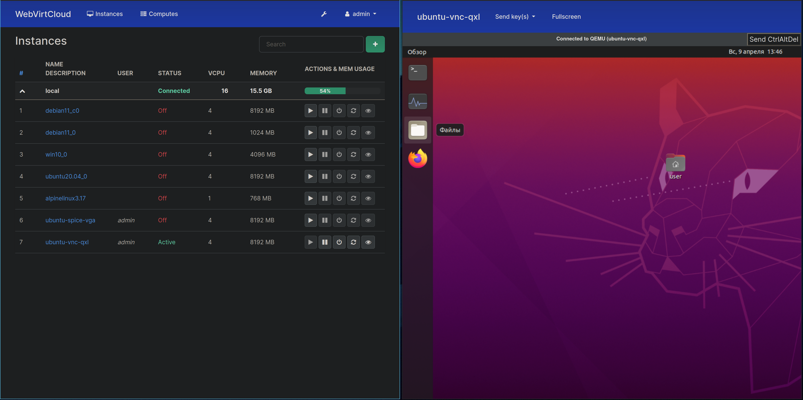

The project is no longer supported.
I moved to Proxmox.

# WebVirtCloud-Docker



## Description

WebVirtCloud is a virtualization web interface for admins and users. It can delegate Virtual Machine's to users. A noVNC viewer presents a full graphical console to the guest domain.  KVM is currently the only hypervisor supported.

## Motivation

Why did I make this fork?
- The main line doesn't give me the option to use it in docker.
- I need a single command solution
- I am concerned about decisions that threaten the security of the server
- I don't like that JS makes requests to third party servers
- The main line has a complex configuration (I need to change `config.py`, generate `token`, configure Reverse-Proxy)
- The main line has many side files (
Vagrantfile, supervisor, runit)

I plan to inherit changes from the mainline as much as possible.

## Install

### KVM config
`/etc/libvirt/libvirtd.conf`
```bash
unix_sock_rw_perms = "0770"
unix_sock_group = "libvirt"
auth_unix_rw = "none"
```

### Container construction
```bash
make build
```
After that, you will have the image `muratovas/webvirtcloud`

### Subnetting
```bash
docker network create --driver=macvlan -o parent=virbr0 -o macvlan_mode=bridge kvm_net
docker network create internet
```
kvm_net - needed to communicate the container with the virtual machine (optional)
internet - bridge to the subnet of your host machine

You need to find out the host ip in the subnet `internet`. 
```bash
docker network inspect internet  
```

Subsequently, register it in `docker-compose.yml`
```yaml
    environment:
      KVM_HOST: "172.24.0.1"
```

### Run
```bash
make start
```
### Reverse-Proxy
Does not require special settings. I am using `nginx`.

## Default credentials
```html
login: admin
password: admin
```
## Security
Be careful to `/etc/libvirt/libvirtd.conf`.
Set `QEMU_CONSOLE_LISTENER_ADDRESSES`.


## Work plan
### FIXME:
- [ ] Integrate `gstfsd:16510`
- [ ] Decide what to do with `migrations`

### TODO:
- [ ] Check `SSH` 
- [ ] Delete all external dependencies `JS`
